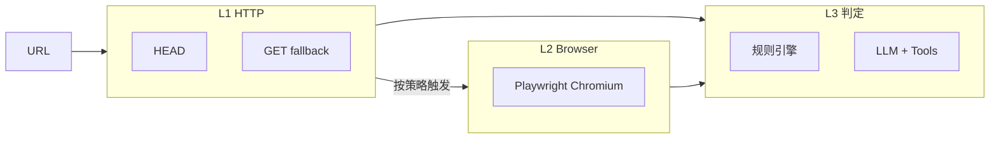

# Linkscope 链接有效性探测架构

## 分层流水线

1. **L1 `HttpProbeService`**：低延迟、可批量；易被 WAF/短链站「假状态」欺骗。
2. **L2 `BrowserProbeService`**：真实 DOM 与多次前端跳转后的 `finalUrl`；成本与耗时更高。
3. **L3 `ClassifyService` + `AiService`**：规则优先处理明确信号；模糊场景由 AI 融合，必要时调用 `fetch_url` / `fetch_url_rendered`。

## 扩展点（按优先级）

| 扩展点 | 说明 |
|--------|------|
| `HttpProbeService.shouldTriggerBrowserFallback` | 何时必须上浏览器；与平台配置联动。 |
| `ClassifyService.applyRules` | HTTP 与浏览器证据的冲突消解（反爬假 404、假首页重定向等）。 |
| `packages/shared/platforms.ts` | 各站 `deadPatterns` / `loginPatterns` 等可运营配置。 |
| `AiService` 工具 | 新增 MCP 式工具（如 Cookie 池、区域代理）时在此注册并实现。 |
| 独立 Adapter 包（未来） | 高价值单站可拆官方 API / 签名请求，由 `sourceOfTruth: adapter` 标识。 |

## 设计原则

- **不信任单源**：尤其对配置域内的短链与视频站，HTTP 4xx 不得单独定案。
- **浏览器为仲裁器**：当 L1 与「常识」矛盾时，以 L2 文本与 `finalUrl` 路径为主信号。
- **AI 为最后手段**：消耗 token；工具层应把「可验证事实」喂足，减少幻觉。
